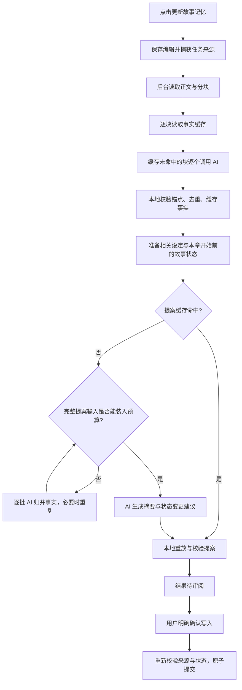

# 记忆更新耗时分析与优化方案

审查日期：2026-10-02。范围：当前 DeepSonder-PySide6 仓库。

实施进展：第一批预算与归并前置优化、第二批逐批检查点与紧凑事实传输、第三批可选的两路有界并发均已完成，详见 [实施说明](memory-performance.md)。下文保留改造前的审查基线与分批路线；预算不一致、归并后截短资料、缺少整次等待上限及批次中断后重复调用的旧路径已被替换。第三批默认仍为串行，真实模型吞吐和外部引擎并发稳定性仍须实测；第四批稳定分块缓存尚未实施。

初次审查完成代码追踪、现有回归测试和临时合成项目验证，当时没有修改运行时代码或用户项目，也没有调用真实模型。本报告区分已确认的机制与尚需真实运行诊断确认的耗时占比；模拟结果不能作为模型速度或事实召回率基准。

## 1. 实现流程

关键代码入口：

| 环节 | 文件与位置 | 行为 |
| --- | --- | --- |
| UI 发起 | `ui/ai_workflow_controller.py:407` | 准备请求、拒绝重叠任务、绑定运行 ID 和取消事件 |
| 总流程 | `core/ai_workflow.py:195` | 事实提取 → 相关资料 → 章前状态 → 记忆提案 |
| 分块提取 | `core/chapter_facts.py:311` | 串行遍历缓存未命中的块，每块单独调用 `generate_json` |
| 提案与归并 | `core/chapter_memory.py:453` | 先查提案缓存；超预算时串行归并；最后调用模型生成建议 |
| 传输 | `core/dsh_client.py:198` | 文件读取探测、任务文件、启动 DSh、回执校验、最多一次回执重试 |
| 确认与提交 | `ui/ai_workflow_controller.py:1439`、`core/ai_result_service.py:99` | 显式确认，检查正文、章前及全局状态，原子写入并使后续记忆失效 |

正常生成阶段只写派生缓存；发起时可先保存已有编辑。模型生成结束与用户完成审阅是两个独立时间点，应分别统计。冲突后的定向重试、重提事实由用户触发，不是无限自动重试。

## 2. 已确认的耗时放大机制

### 串行调用累计

设本次未命中缓存的事实块数为 M，各归并轮次的批次数为 Bᵣ。在提案缓存未命中时，业务 AI 调用数为：

`M + ΣBᵣ + 1 次最终提案`

每次业务调用都会启动新的 DSh 进程并让模型读取任务文件。首次成功探测之前还需要一个单独的文件读取测试；探测成功后，同一 `DSHClient` 实例会复用结果。不能把它算作每块必有的固定成本，也不能把进程、文件读取、模型推理和输出生成混称为纯模型推理时间。

普通单块章节冷运行通常是两次业务调用。长章节的块级输入互不依赖，却仍逐块执行；同一轮归并批次也逐个执行。最后的提案必须等待事实及归并结果。

### 事实体积与固定上下文共同触发归并

事实序列包含字段名、事实 ID、锚点、主体、谓词和值。正文短并不保证事实 JSON 小；人物状态密集、同义重复及多次移动可能增加事实量和输出长度。当前去重按事实 ID 精确匹配，不能消除所有不同措辞的重复。

当完整提示词超预算时，代码先归并事实。只有来源条目已经很少时，才逐步缩减设定文本或人物状态。若主要空间被设定及状态占用，前面的归并未必解决问题，却已增加模型调用。当前最多 10 次循环迭代，迭代内还可能有多个批次；这不是“最多 10 次 AI 调用”。

归并缓存只在整个来源压缩到可生成提案后保存。中途某批失败或取消，已成功批次缺少单独检查点，后续重试可能重新执行它们。

### 回执重试重复完整任务

`core/dsh_client.py:263` 的回执失败恢复会重新启动模型、读取同一任务文件并执行任务。虽然注释称为格式重试，但实际不是一次廉价的本地格式修正。大输出发生回执错误时，这一请求可能接近完整执行两遍。必须保留文件完整读取的验证，不能直接采纳缺少有效回执的业务 JSON。

默认应用配置 `dsh_timeout=600` 秒；该限制分别用于原调用和回执重试，没有覆盖整个记忆流程。一个请求若原生成和回执重试都接近上限，就可能累计约 1,200 秒，首次探测还可再用最多 30 秒，另有本地及清理时间。这是路径允许的等待量，不是已经测得的用户耗时；一般执行超时本身并不触发回执重试。

### 编辑后缓存复用范围有限

事实缓存键包含提示词版本、章节 ID、块 ID 和内容哈希。块 ID 又包含序号及绝对段落范围；分块边界随正文变化重新计算。章尾小改可以复用前面的块；章首插入段落会使后面的锚点或分组变化，导致大量未修改文本也不能复用。

提案缓存按章节正文、完整章前状态和完整相关设定哈希失效，这是避免采用过期建议所需的保护。定向重试可复用事实及归并缓存；“重提事实”主动绕过这些缓存，耗时更高属于该操作的预期行为。当前提示词版本升级也会造成首次派生缓存失效；已有的中章合块、精简输出和三层缓存已生效，不应重复当作待实施优化。

### 组装预算与传输预算不一致

事实及提案组装器主要检查业务 system/user 提示词；DSHClient 还检查自身包装后的提示词，并考虑配置的模型窗口与运行预留。中章自适应合块检查额外留了 512 token，但普通提取和提案归并判断没有统一使用传输层的同一准入计算。接近边界时，会出现“组装通过，发送前拒绝”，导致已经执行的前置提取或归并无法产出最终结果。

### 本地开销需要按阶段判断

分块和归并打包会反复渲染并估算候选输入；资料选择会读本地资料，章前状态解析需检查历史来源依赖。大项目或慢磁盘可能放大这些成本。但合成测试中的正文分块只有毫秒级，不能据此认定用户的几分钟等待来自本地分块，也不能据此排除大型真实项目的本地瓶颈。

## 3. 本次验证结果

运行现有记忆性能、事实提取、提案、失败恢复、地点证据、已采用记忆、DSh 传输、任务面板及延后审阅测试，共 9 个模块、121 项测试，通过。测试发现方式将 `tests` 加入模块搜索路径；直接按包导入部分测试会因其同目录导入而失败，应沿用仓库发现方式。未执行全仓库发行检查，因为本次没有运行时代码变更。

临时项目使用默认 24,000 输入预算、5,000 分块预算、300 重叠预算；文本由带编号的短段落和填充字组成。模拟模型每块只返回一条事件事实，不代表真实小说事实密度。以下调用数不含传输探测及回执重试：

| 合成正文字符数 | 块数 | 首次业务调用 | 原样重复调用 | 章尾改一字后的可复用块 | 章首插段后的可复用块 | 分块耗时中位数，5 次 |
| --- | --- | --- | --- | --- | --- | --- |
| 3,000 | 1 | 2 | 0 | 0/1 | 0/1 | 4.56 ms |
| 6,000 | 1 | 2 | 0 | 0/1 | 0/1 | 13.77 ms |
| 12,000 | 3 | 4 | 0 | 2/3 | 0/3 | 20.39 ms |
| 30,000 | 8 | 9 | 0 | 7/8 | 0/8 | 50.02 ms |

所有合成项目在两次生成前后的文件字节一致，提案缓存均可复用。章首/章尾修改的复用数按块 ID 与内容哈希对比；没有把这些编辑应用于任何真实项目。

另用 40 条长值事实、4,000 输入预算、1,000 归并批预算验证：无设定时需 20 次归并；加入 12,000 字符固定设定后需 23 次归并，归并轮数从 1 增到 3。模拟归并器每批只保留一条简短 claim，因此此结果只验证固定上下文会放大调用，不能评价事实覆盖率或真实归并质量。

预算边界合成样本确认：业务估算 3,930 token 通过 4,000 的组装上限；DSHClient 包装估算 4,001 token，会在发送前拒绝。此验证只执行预算计算，没有启动 DSh。

## 4. 推荐实施顺序

### 第一批：统一预算、约束无效归并、补全任务诊断

1. 让事实、归并、提案组装与 DSHClient 共用一个准入函数，覆盖业务包装、传输预留和配置的模型窗口。组装时使用实际可用预算；超限时先重新分块或重新分配上下文，避免临发送才发现不一致。
2. 生成提案前计算“固定协议 + 必需旧状态 + 必需设定”的成本，再分配事实空间。按相关性和必需性选择完整资料条目；当必需内容无法容纳时明确报告空间不足，避免反复压缩事实后再靠截断设定解决。不能删掉约束某个 Patch 的关键规则来换速度。
3. 为每轮归并记录输入/输出估算 token、批次数、压缩率和证据覆盖。连续不收敛时停止并给出可恢复原因；不要仅靠 10 次迭代兜底，也不要为收敛硬截事实条数。
4. 在现有逐请求脱敏报告基础上，增加任务级运行 ID、请求所属块/批次、缓存未命中原因、总请求数、归并轮数和阶段汇总。现有侧栏已保留本次全部请求报告，无需再实现一套重复记录。生成耗时目前无法拆成模型推理和工具读取时间；只有外部引擎提供可信事件时才细分。
5. 增加可配置的整次任务截止时间；探测、原请求和回执重试都使用剩余时间，避免每一步重新获得完整等待额度。时间不足时停止新请求并安全结束，保留此前已校验的派生缓存，允许用户重新发起恢复。总等待上限用于约束故障尾部延迟，不应设成会频繁打断正常长章节的任意短时限，也不能据此声称成功任务更快。

收益：减少可避免的归并与发送前失败，为后续优化提供真实依据。改动集中于预算及编排，适合作为第一批稳定性改造。

### 第二批：归并检查点与紧凑事实传输

1. 为通过校验的归并批次分别保存派生缓存，键包含协议/提示词版本、准确输入事实及顺序、相关配置指纹。失败重跑只重做未完成批次；不缓存非法或取消后的迟到结果。组装整章前再次验证当前输入，检查点不等于已采用记忆。
2. 模型输入可用请求内短 ID 和紧凑记录表示事实；完整 ID、锚点及证据仍保留在本地。响应短 ID 必须从该请求自己的映射还原，拒绝未知 ID。先测压缩幅度和语义等价，再决定是否升级协议，不能把减少 JSON 字符直接宣称为固定比例提速。
3. 保持事实与提案分离，保留独立变化、矛盾、时间顺序和人物到达证据。不要通过合并两阶段、硬裁条数或跳过证据校验来减少请求。

收益：中途失败恢复更快，密集事实更少触发归并；原始事实和校验规则保持可审计。

### 第三批：有界并发，先以 2 为试验上限

仅并发同一章节互不依赖的事实块，以及同一轮互不依赖的归并批次。事实完成后再生成提案；跨轮和前后章节状态依赖继续按顺序执行。

不能直接把同一个 DSHClient 交给多个线程：它维护可变工作目录、探测状态、命令诊断和回调。应使用固定数量的独立客户端，每个有独立工作目录与会话；客户端配置和任务来源来自同一快照。外部引擎共用的凭据、会话存储或插件状态是否允许并发也需在当前安装版本中确认。

按块索引确定性合并；进度按完成数量报告；取消或失败后停止排队、终止全部相关子进程并等待清理，再允许下一任务。将所有报告关联到运行 ID，隔离迟到结果。若服务限流、故障率或尾部延迟变差，整体回退为串行，避免自动重发已成功批次。并发会增加瞬时资源需求，不保证模型服务允许两次请求同时快速完成。

收益：长章节的提取及同轮归并等待可缩短；单块章节通常没有收益。开启默认并发之前必须验证真实模型和外部引擎行为。

### 第四批：稳定分块与增量事实缓存

为长章节设计在局部编辑后可以重新同步的分块边界；缓存以精确内容及必要邻接上下文标识，使用块内相对证据位置。插入段落后，只有内容及证据上下文完全一致的块才允许复用；将相对位置重新映射到当前正文，重新验证锚点并生成本地事实 ID。重复段落、代词上下文变化和边界变化有歧义时重新提取，不能用模糊文本匹配接受旧锚点。

事实更新后，提案仍绑定当前完整正文、当前章前状态及相关设定。提案缓存建议同时纳入事实账本指纹和新协议版本，避免改用稳定块或重新提取策略后复用另一份事实来源的提案。旧派生缓存隔离，不迁移已采用记忆。

收益：编辑早期段落后不再必然重算整章。该方案涉及证据身份和缓存协议，风险高于前面几批，不建议先实施。

### 后续候选：持久引擎或专用生成入口

每次启动 DSh 的实际成本尚未单独量化。只有测得启动/工具读取占主要时间，且当前安装版本存在经过验证的稳定入口时，再评估持久连接或专用结构化生成适配器。先建立功能开关和现有 CLI 回退，隔离每次任务上下文，保留凭据管理边界、取消和传输完整性验证。

不要通过连续复用历史对话来代替独立任务，避免旧章节内容污染事实。官方当前仍将 DSh 标记为 developer preview，并提示可能存在破坏性变更；不能假定最新服务入口与用户本地版本兼容。来源：[DeepSeek Harness 官方项目](https://github.com/deepseek-ai/deepseek-harness)。

## 5. 稳定性与验收

测试用临时项目或明确的项目副本，不发送真实私稿来做性能实验。保持正文/状态过期检测、显式确认、Patch 前置条件、取消、原子提交、后续章节失效及只读旧项目导入边界。

按短章、中章、长章、人物移动密集章建立代表性样本；分别测首次、原样重复、章首编辑、章尾编辑、仅状态/设定变化、失败恢复。使用相同模型、配置和样本，记录冷启动与热启动，比较多次运行的中位数及尾部延迟；样本量不足时不要声称稳定的 P95 改善。

| 维度 | 验收要求 |
| --- | --- |
| 性能 | 真实总生成时间、阶段时间、业务请求数、探测数、回执重试数、归并轮数及缓存命中能解释等待来源 |
| 预算 | 接近上限、低预算和模型窗口约束下，组装与发送的准入结果一致 |
| 归并 | 固定上下文不足可提前报告；不收敛可停止；成功批次可恢复；证据及独立变化不因压缩丢失 |
| 并发 | 并行返回乱序仍正确；取消所有进程；迟到结果不污染下一次任务；限流可回退；不混用客户端文件或报告 |
| 缓存 | 原样重复免业务调用；编辑/协议/来源变化正确失效；重映射无歧义；损坏缓存安全重建 |
| 质量 | 人工比较事实遗漏、人物地点错误、矛盾检出与错误 Patch；质量不能因速度改善下降 |
| 数据安全 | 生成和审阅前不采用记忆；旧来源拒绝提交；取消不写模型结果；提交失败可恢复 |
| UI | 若变更进度显示，覆盖窄桌面、浅/深主题和提高缩放；待审阅与取消状态不被迟到进度覆盖 |

真实“慢在哪一段”的占比还需用户已有的脱敏工作记录与“本次上下文”报告确认。当前最稳妥的交付路线是：先统一预算及归并规划，再做检查点和紧凑传输，之后验证并发 2，最后重构稳定分块；无需与其他产品系列同步。
